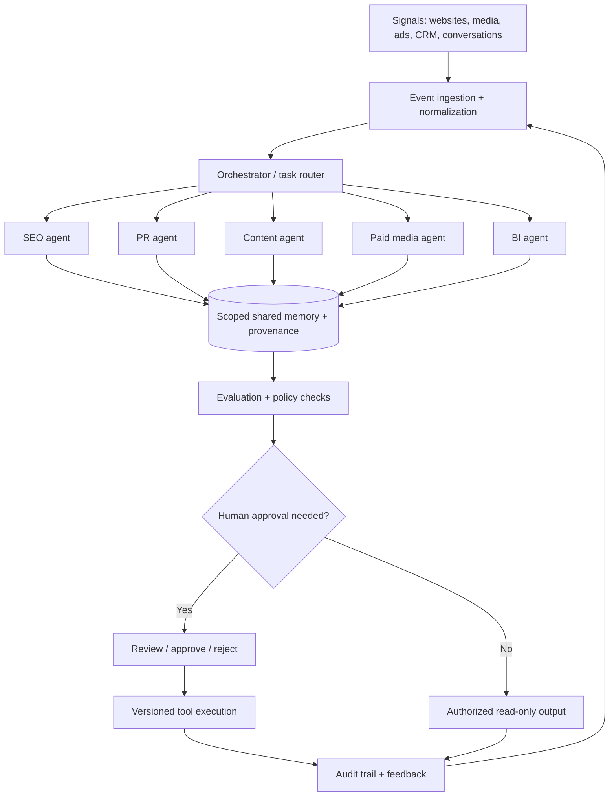
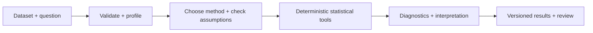
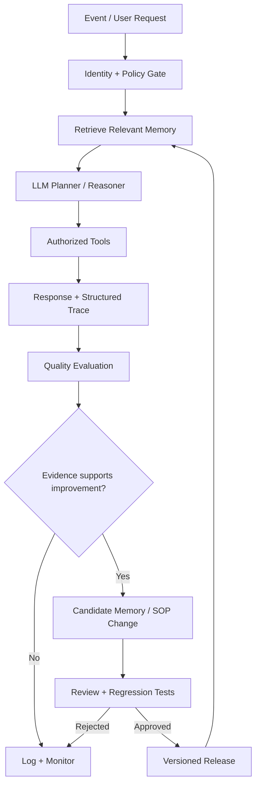

<div align="center">

# ✳ MILA.exe

**AI Agent Engineering · Memory Architectures · Multi-Agent Marketing Intelligence · Autonomous Systems**

`[ SYSTEM ONLINE ]` · `[ HUMAN-IN-THE-LOOP ]` · `[ ALWAYS EVALUATING ]`

*myspace-era internet energy, production-grade engineering discipline.*

</div>

---

### `~/about $ whoami`

I design and build **stateful AI agents** that use tools, retain relevant context, coordinate workflows, and improve their behavior through **evaluation and governed feedback loops**.

My work sits at the intersection of **LLM orchestration, conversational agents, AI-driven SEO, public relations intelligence, content systems, advertising automation, business analytics, workflow engineering, and agent reliability**. I care about the part after the demo: tracing failures, preserving memory safely, measuring outcomes, and shipping changes without breaking production.

> **An agent that remembers is not necessarily an agent that learns.** Durable memory, retrieval, feedback, policy updates, and model training are separate mechanisms. Good systems make those boundaries explicit.

### `~/systems $ ls`

| System | Engineering focus |
| :--- | :--- |
| 🧠 **Memory-aware agents** | Episodic / semantic / procedural memory, retrieval ranking, provenance, TTL, consolidation, deletion |
| 🔁 **Continuous improvement** | Transcript review, error taxonomy, offline evaluations, candidate policy updates, regression gates |
| 🎙️ **Voice & conversational AI** | Speech-driven agents, identity verification, tool calling, handoff, call-quality instrumentation |
| ⚙️ **Workflow orchestration** | Event ingestion, idempotency, queues, retries, dead-letter handling, scheduled jobs |
| 🛡️ **Agent governance** | Scoped permissions, human approval, PII minimization, audit trails, rollback |
| 📈 **Observability** | Traces, latency, token cost, tool failures, hallucination flags, outcome metrics |

### `~/agent-universe $ ls --all`

I explore **specialized agents that collaborate across business functions**, rather than forcing one general-purpose model to do everything. The patterns below describe engineering domains and reference architectures—not claims that every agent is publicly deployed.

| Agent archetype | Technical responsibilities | Evaluation / control plane |
| :--- | :--- | :--- |
| 🔎 **SEO Intelligence Agent** | Site crawling, robots/sitemap parsing, technical audits, structured-data checks, keyword clustering, SERP signals, content recommendations, proposed CMS edits | Crawl coverage, canonical correctness, evidence snapshots, approval before publishing |
| 📣 **Public Relations Agent** | Media monitoring, entity resolution, journalist/outlet research, sentiment and narrative clustering, briefing drafts, outreach planning | Source attribution, factual verification, editorial approval, contact privacy |
| ✍️ **Content Strategy Agent** | Editorial calendars, search-intent mapping, content briefs, brand-voice retrieval, multilingual draft generation, internal-link suggestions | Brand consistency, citation coverage, originality review, human publishing gate |
| 🎯 **Paid Media Agent** | Campaign telemetry, search-term analysis, audience segmentation, anomaly detection, bid/budget recommendations, creative testing hypotheses | Attribution caveats, spend limits, change approvals, experiment tracking |
| 📊 **Business Intelligence Agent** | SQL/warehouse retrieval, metric definitions, KPI anomaly detection, cross-channel attribution, executive summaries | Query validation, metric lineage, freshness SLAs, numerical consistency |
| 🎙️ **Conversational Operations Agent** | Voice and email intake, identity-aware context, persistent interaction memory, tool-based workflows, escalation and follow-up | Verification, policy compliance, handoff reliability, hallucination and outcome monitoring |
| 🧠 **Memory & Evaluation Agent** | Episodic/semantic memory extraction, contradiction detection, retrieval scoring, trace evaluation, candidate SOP improvements | Tenant isolation, consent/TTL, eval benchmarks, reviewer-approved promotion |

#### `~/multi-agent $ cat coordination.mmd`



**Architectural boundary:** shared intelligence does not mean shared unrestricted access. Each agent gets its own tool scopes, memory namespace, identity context, and approval policy. A content recommendation is not permission to publish; an ad recommendation is not permission to spend.

#### `~/engineering-notes $ cat agent-contract.ts`

```ts
type AgentDomain = "seo" | "pr" | "content" | "paid_media" | "bi";
type Risk = "read_only" | "draft" | "external_write";

interface AgentTask {
  id: string;                 // idempotency key
  tenantId: string;           // enforced at every data boundary
  domain: AgentDomain;
  objective: string;
  sourceRefs: string[];       // provenance, not raw secrets
  requestedAction: Risk;
  policyVersion: string;
}

interface AgentResult {
  taskId: string;
  status: "proposed" | "approved" | "rejected" | "completed";
  evidenceRefs: string[];
  confidence: number;        // calibrated against evaluation data
  toolTraceId: string;
  requiresHumanApproval: boolean;
}

// Example contract only: the executor must separately authenticate,
// authorize, validate, deduplicate, and audit every side effect.
```

### `~/analytics $ ./STAT.exe`

> **✳ STAT.exe** — Statistical Intelligence & Data Science Agent

A reproducible **statistical-analysis agent blueprint** for dataset profiling, descriptive statistics, correlation, regression, hypothesis-test planning, data-quality checks, and uncertainty-aware interpretation. The reference implementation computes descriptive summaries, Pearson correlation, and simple OLS; advanced inference is documented as a planned extension.



```bash
python examples/stat_agent.py
python -m unittest discover -s tests -v
```

**Explore:** [Architecture & method selection](docs/statistical-analysis-agent.md) · [Python analysis engine](examples/stat_agent.py) · [Regression tests](tests/test_stat_agent.py)

**Operating principle:** `measure → validate → compute → verify → explain`. The LLM plans and narrates; deterministic code performs the math. Correlation is not causation.

### `~/architecture $ cat learning-loop.txt`



**Learning loop ≠ autonomous weight updates.** The diagram describes controlled memory and behavior updates. Model fine-tuning, when appropriate, is a separate, versioned training pipeline.

### `~/stack $ cat toolkit.yml`

```yaml
languages: [Python, TypeScript, SQL]
agent_runtime: [LLM APIs, tool calling, structured outputs]
orchestration: [n8n, webhooks, event-driven workflows]
memory_and_state: [Convex, structured records, retrieval pipelines]
voice: [ElevenLabs, Twilio]
engineering: [GitHub, CI/CD, tests, observability]
interests: [agent evaluation, MCP, self-improving workflows, safe automation]
```

### `~/lab $ open-source`

I'm building a public engineering notebook for people developing **memory-based and continuously evaluated AI agents**.

- **[Agent Memory Blueprint](docs/agent-memory-blueprint.md)** — data model, retrieval, retention, and consolidation patterns.
- **[Agent Improvement Loop](docs/agent-improvement-loop.md)** — trace → evaluate → propose → test → approve → deploy.
- **[Memory Scoring Reference](examples/memory_ranker.py)** — dependency-free, runnable Python example for ranking memory candidates.

These are **reference designs and educational examples**, not claims that a complete production system has been open-sourced.

### `~/principles $ cat rules.md`

```text
01  Memory is evidence, not authority.
02  Retrieved text is untrusted input.
03  Every consequential tool call has an authorization boundary.
04  Evaluate before promoting a new behavior.
05  Version prompts, policies, memories, and releases.
06  Prefer reversible changes; log who approved what.
07  Minimize personal data; support retention and deletion.
08  Never confuse confident output with verified truth.
```

### `~/connect $ ping`

[LinkedIn](https://www.linkedin.com/in/milajoselyn)

<sub>✳ Built for curious engineers, careful operators, and people who think AI agents should be observable, testable, and accountable.</sub>
