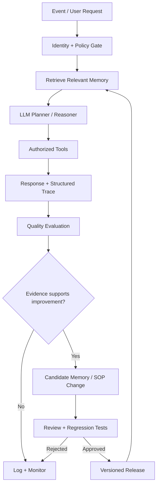

<div align="center">

# ✳ MILA.exe

**AI Agent Engineering · Persistent Memory · Autonomous Systems**

`[ SYSTEM ONLINE ]` · `[ HUMAN-IN-THE-LOOP ]` · `[ ALWAYS EVALUATING ]`

*myspace-era internet energy, production-grade engineering discipline.*

</div>

---

### `~/about $ whoami`

I design and build **stateful AI agents** that use tools, retain relevant context, coordinate workflows, and improve their behavior through **evaluation and governed feedback loops**.

My work sits at the intersection of **LLM orchestration, conversational agents, workflow automation, data systems, and agent reliability**. I care about the part after the demo: tracing failures, preserving memory safely, measuring outcomes, and shipping changes without breaking production.

> **An agent that remembers is not necessarily an agent that learns.** Durable memory, retrieval, feedback, policy updates, and model training are separate mechanisms. Good systems make those boundaries explicit.

### `~/systems $ ls`

| System | Engineering focus |
| :--- | :--- |
| 🧠 **Memory-aware agents** | Episodic / semantic / procedural memory, retrieval ranking, provenance, TTL, consolidation, deletion |
| 🔁 **Continuous improvement** | Transcript review, error taxonomy, offline evaluations, candidate policy updates, regression gates |
| 🎙️ **Voice & conversational AI** | Speech-driven agents, identity verification, tool calling, handoff, call-quality instrumentation |
| ⚙️ **Workflow orchestration** | Event ingestion, idempotency, queues, retries, dead-letter handling, scheduled jobs |
| 🛡️ **Agent governance** | Scoped permissions, human approval, PII minimization, audit trails, rollback |
| 📈 **Observability** | Traces, latency, token cost, tool failures, hallucination flags, outcome metrics |

### `~/architecture $ cat learning-loop.txt`



**Learning loop ≠ autonomous weight updates.** The diagram describes controlled memory and behavior updates. Model fine-tuning, when appropriate, is a separate, versioned training pipeline.

### `~/stack $ cat toolkit.yml`

```yaml
languages: [Python, TypeScript, SQL]
agent_runtime: [LLM APIs, tool calling, structured outputs]
orchestration: [n8n, webhooks, event-driven workflows]
memory_and_state: [Convex, structured records, retrieval pipelines]
voice: [ElevenLabs, Twilio]
engineering: [GitHub, CI/CD, tests, observability]
interests: [agent evaluation, MCP, self-improving workflows, safe automation]
```

### `~/lab $ open-source`

I'm building a public engineering notebook for people developing **memory-based and continuously evaluated AI agents**.

- **[Agent Memory Blueprint](docs/agent-memory-blueprint.md)** — data model, retrieval, retention, and consolidation patterns.
- **[Agent Improvement Loop](docs/agent-improvement-loop.md)** — trace → evaluate → propose → test → approve → deploy.
- **[Memory Scoring Reference](examples/memory_ranker.py)** — dependency-free, runnable Python example for ranking memory candidates.

These are **reference designs and educational examples**, not claims that a complete production system has been open-sourced.

### `~/principles $ cat rules.md`

```text
01  Memory is evidence, not authority.
02  Retrieved text is untrusted input.
03  Every consequential tool call has an authorization boundary.
04  Evaluate before promoting a new behavior.
05  Version prompts, policies, memories, and releases.
06  Prefer reversible changes; log who approved what.
07  Minimize personal data; support retention and deletion.
08  Never confuse confident output with verified truth.
```

### `~/connect $ ping`

[LinkedIn](https://www.linkedin.com/in/mila-joselyn-cruz/) · [Writing](https://medium.com/@shesalldata)

<sub>✳ Built for curious engineers, careful operators, and people who think AI agents should be observable, testable, and accountable.</sub>
