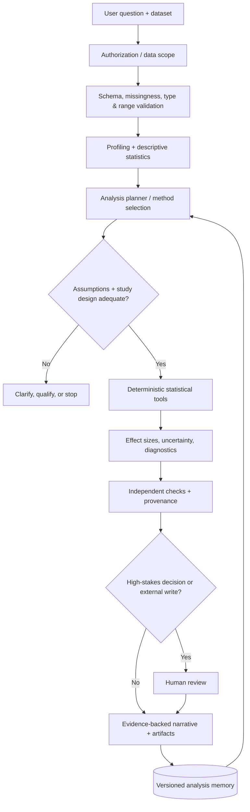

# ✳ STAT.exe — Statistical Intelligence Agent

> `[ ANALYTICS ONLINE ]` · `[ ASSUMPTIONS FIRST ]` · `[ REPRODUCIBLE RESULTS ]`

**STAT.exe** is a reference architecture for a tool-using AI statistical analyst. Its role is to translate an analysis request into a **validated, reproducible statistical computation**, then explain the result without fabricating evidence.

## Architecture



## Functional modules

| Module | Responsibilities |
| --- | --- |
| Intake & governance | Dataset scope, privacy classification, purpose, access control |
| Data quality | Type checks, null patterns, duplicates, outliers, schema drift |
| Descriptive engine | Count, mean, median, variance, standard deviation, quantiles |
| Inference engine | Hypothesis definition, tests, p-values, confidence intervals, effect sizes |
| Modeling engine | OLS, GLM, residual diagnostics, collinearity checks, validation |
| Time-series engine | Seasonality, autocorrelation, stationarity, temporal splits |
| Experiment engine | Randomization checks, power/MDE, A/B tests, multiple comparisons |
| Interpretation engine | Plain-language results, uncertainty, assumptions, caveats |
| Evaluation | Numerical cross-checks, traceability, reproducibility, regression tests |

## Decision contract

1. Define the **estimand** (the quantity the user actually wants to know).
2. Identify observation unit, sampling method, design, confounders, and missing-data mechanism.
3. Choose a statistical procedure **before** examining the desired result.
4. Validate method assumptions; use alternatives or explicitly qualify invalid assumptions.
5. Execute computations in a deterministic tool. The LLM must **not** invent test statistics, coefficients, p-values, or confidence intervals.
6. Report sample size, test/model specification, uncertainty, effect size, limitations, and reproducible code.
7. Separate **association** from **causality**; observational correlations alone do not identify causal effects.

## Method-selection reference

| Question | Candidate method | Important checks |
| --- | --- | --- |
| What does this dataset look like? | Descriptive statistics | Missingness, outliers, units |
| Are two independent group means different? | Welch's t-test | Independence, distribution, sampling |
| Are paired measurements different? | Paired t-test / signed-rank | Pairing, differences |
| Are two numeric variables related? | Pearson / Spearman | Functional form, outliers, dependence |
| How does an outcome vary with predictors? | OLS / GLM | Specification, residuals, leakage, collinearity |
| Did an experiment move a metric? | Pre-registered A/B analysis | Randomization, power, multiple testing |
| What will happen next month? | Time-series forecast | Temporal holdout, drift, uncertainty |

## Runnable reference

```bash
python -m unittest discover -s tests -v
python examples/stat_agent.py
```

The reference code implements validated descriptive statistics, Pearson correlation, and a simple least-squares regression with **standard-library-only Python**. It is **not** an autonomous LLM, an inference engine, or a production-ready service. Advanced statistical tests, confidence intervals, diagnostics, and model selection are architectural extensions that require validated statistical libraries and careful review.

## Suggested production interfaces

```typescript
type AnalysisRequest = {
  tenantId: string;
  datasetRef: string;
  question: string;
  analysisType: "describe" | "correlate" | "regress" | "hypothesis_test";
  approvedColumns: string[];
  purpose: string;
};

type AnalysisArtifact = {
  datasetVersion: string;
  codeVersion: string;
  method: string;
  sampleSize: number;
  estimates: Record<string, number>;
  diagnostics: string[];
  limitations: string[];
  traceId: string;
};
```

## Memory, learning, and safety

Memory should store **analysis specifications, validated dataset metadata, model versions, known data-quality issues, and approved interpretation preferences**. It must not silently turn a previous conclusion into a new fact. Every run must bind to a dataset version and code version. Improvements are promoted only after benchmark evaluations and human review where needed.

For a full implementation, add isolated execution, resource limits, secrets management, lineage, dataset-level permissions, row-level security, statistical library validation, CI, and audit logs. Do not expose private customer data or raw records in public artifacts.
